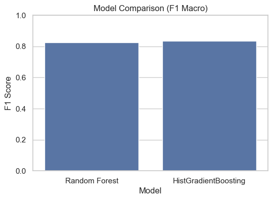
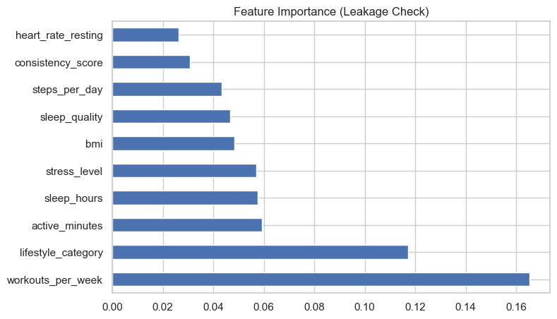

# Fitness Level Prediction using Machine Learning

## Project Overview

This project builds an **end-to-end multiclass classification system** to predict an individual's **fitness level** using behavioral and physiological indicators.

It combines practical machine learning engineering with data mining methodology, including:

- Exploratory Data Analysis (EDA)
- Feature engineering
- Data preprocessing
- Custom SMOTE implementation
- Random Forest modeling
- Histogram Gradient Boosting modeling
- Hyperparameter tuning
- Cross-validation
- Sampling experiments
- Feature importance analysis
- Leakage detection

> Goal: Build a reliable, interpretable, and high-performance classification model for fitness level prediction.

---

# Problem Statement

Physical inactivity is associated with major health risks and increasing healthcare costs.

This project explores whether machine learning can classify individuals into:

- Unfit  
- Moderate  
- Fit

using health and lifestyle indicators.

### Potential Applications
- Fitness applications  
- Preventive healthcare  
- Corporate wellness programs  
- Coaching and training systems  

---

# Dataset Information

**Dataset Source:**  
Synthetic Health Indicators Dataset (Kaggle)

https://www.kaggle.com/datasets/parasharmanu/synthetic-health-indicators-dataset

### Dataset Characteristics

- 1,000,000+ records
- 15 features
- 3 target classes
- Synthetic structured tabular data

### Features Used

Examples:

- steps_per_day  
- active_minutes  
- bmi  
- sleep_hours  
- sleep_quality  
- heart_rate_resting  
- workouts_per_week  
- stress_level  
- diet_quality  
- sedentary_minutes  
- consistency_score  
- lifestyle_category  

### Target Variable
`fitness_level`

---

# Machine Learning Pipeline

## 1. Data Understanding
- Missing value analysis
- Distribution checks
- Correlation heatmaps

## 2. Exploratory Data Analysis (EDA)
- Pair plots
- Distribution plots
- Class imbalance visualization
- Feature relationship analysis

## 3. Data Preprocessing
- Label encoding
- Feature scaling
- Stratified train-test split
- Outlier checks

## 4. Feature Engineering

Created engineered composite feature:

### `fitness_score`

Built using weighted contributions from:

- Steps  
- Active minutes  
- Sleep quality  
- Diet quality  
- Workout frequency  
- Sedentary behavior (inverted)  
- Stress level (inverted)

Leakage-aware analysis was performed by excluding this feature from interpretation plots.

---

## 5. Class Imbalance Handling

Implemented **custom SMOTE** using synthetic interpolation for minority oversampling.

Compared:

- Original distribution  
- SMOTE-balanced data  
- Model behavior with and without SMOTE

---

## 6. Models Used

### Random Forest
Used for:

- Nonlinear classification  
- Robustness on tabular data  
- Feature importance analysis  

---

### HistGradientBoostingClassifier

Histogram-based gradient boosting model used as scalable boosting alternative.

Benefits:

- Efficient on large datasets  
- Strong predictive performance  
- Well suited for structured features  

---

## 7. Hyperparameter Tuning

Used:

- RandomizedSearchCV  
- Stratified K-Fold Cross Validation  

---

## 8. Evaluation Metrics

Metrics:

- Accuracy  
- Precision  
- Recall  
- Macro F1 Score  
- Classification Report  
- Confusion Matrix

---

## 9. Sampling Sensitivity Analysis

Evaluated performance across:

- 50K samples  
- 100K samples  
- 250K samples

Purpose:

- Stability analysis  
- Computational tradeoff analysis  
- Generalization behavior

---

## 10. Leakage Analysis

Validation checks performed to ensure:

✔ No target leakage  
✔ Real-world generalization integrity  
✔ Feature importance robustness  

---

# Results Summary

## Approximate Results

| Model | Accuracy | F1 Macro |
|------|----------|----------|
| Random Forest | ~95% | ~0.94 |
| HistGradientBoosting | ~96% | ~0.95 |
| Tuned Random Forest | ~96% | ~0.95 |

### Key Findings

✔ Behavioral features dominated prediction  
✔ Steps and active minutes were strongest predictors  
✔ Larger sample sizes improved stability  
✔ SMOTE improved minority class recall  
✔ Leakage checks supported result integrity  

---

# Visualizations

### Model Comparison



---

### Feature Importance



---

Additional visuals include:

- Fitness level distribution  
- Correlation heatmap  
- Confusion matrix heatmap  
- EDA distributions  

---

# Tech Stack

- Python 
- Pandas
- NumPy
- Matplotlib
- Seaborn
- Scikit-learn
- Imbalanced-learn

---

# Project Structure

```text
fitness-level-prediction/
│
├── README.md
├── requirements.txt
├── .gitignore
│
├── data/
│   └── dataset_link.txt
│
├── images/
│   ├── model_comparison.png
│   └── feature_importance.png
│
├── notebooks/
│   └── fitness_prediction.py
│
└── presentation/
    └── FitnessLevel_DataMining_Presentation.pptx
```

---

# Installation

Clone repository:

```bash
git clone https://github.com/Haitham920/fitness-level-prediction.git
cd fitness-level-prediction
```

Install dependencies:

```bash
pip install -r requirements.txt
```

---

# Run Project

Run full pipeline:

```bash
python notebooks/fitness_prediction.py
```

Or explore interactively:

```bash
jupyter notebook
```

---

#  Why This Project Stands Out

✔ Full end-to-end ML lifecycle implementation  
✔ Includes custom SMOTE (not just library use)  
✔ Sampling sensitivity experiments  
✔ Leakage analysis   
✔ Model comparison + tuning  
✔ Interpretable ML through feature importance  
 

---

#  Limitations

- Synthetic dataset may not reflect real-world populations
- No longitudinal temporal modeling
- Deep learning models not explored
- Custom SMOTE is simplified compared to production implementations

---

# Future Improvements

Potential extensions:

- SHAP explainability  
- LightGBM / XGBoost benchmarking  
- Real-world health datasets  
- Deep learning models  
- Longitudinal fitness trajectory modeling  

---

# Presentation

Project presentation available in:

```text
presentation/FitnessLevel_DataMining_Presentation.pptx
```

---

# Author

 Haitham Maatar  
  


